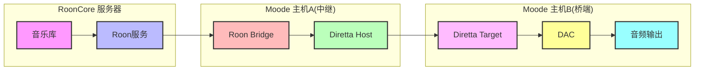
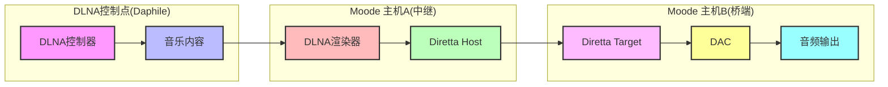

# nanopim4
uboot &amp; dtb

```mermaid
flowchart LR
    subgraph "RoonCore 服务器"
    A[音乐库] --> B[Roon服务]
    end
    subgraph "Moode 主机A(中继)"
    B --> C[Roon Bridge]
    C --> D[Diretta Host]
    end
    subgraph "Moode 主机B(桥端)"
    D --> E[Diretta Target] --> F[DAC] --> G[音频输出]
    end
    
    style A fill:#f9f,stroke:#333,stroke-width:2px
    style B fill:#bbf,stroke:#333,stroke-width:2px
    style C fill:#fbb,stroke:#333,stroke-width:2px
    style D fill:#bfb,stroke:#333,stroke-width:2px
    style E fill:#fbf,stroke:#333,stroke-width:2px
    style F fill:#ff9,stroke:#333,stroke-width:2px
    style G fill:#9ff,stroke:#333,stroke-width:2px
```

```mermaid
flowchart LR
    subgraph "DLNA控制点(Daphile)"
    A[DLNA控制器] --> B[音乐内容]
    end
    subgraph "Moode 主机A(中继)"
    B --> C[DLNA渲染器]
    C --> D[Diretta Host]
    end
    subgraph "Moode 主机B(桥端)"
    D --> E[Diretta Target] --> F[DAC] --> G[音频输出]
    end
    
    style A fill:#f9f,stroke:#333,stroke-width:2px
    style B fill:#bbf,stroke:#333,stroke-width:2px
    style C fill:#fbb,stroke:#333,stroke-width:2px
    style D fill:#bfb,stroke:#333,stroke-width:2px
    style E fill:#fbf,stroke:#333,stroke-width:2px
    style F fill:#ff9,stroke:#333,stroke-width:2px
    style G fill:#9ff,stroke:#333,stroke-width:2px
```
